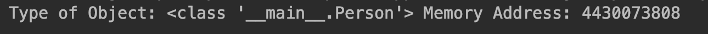

1.1 理解面向对象变成
===

<p style="text-indent:2em">
在开始学习设计模式之前，我们不妨先来了解一下相关的基础知识，并进一步熟悉 Python 面向对象的范式。面向对象的世界引入了对象的概念，而这些对象又具有属性（数据成员）和过程（成员函数）。这些函数的作用就是处理属性。
</p>

<p style="text-indent:2em">
这里，我们以对象 car 为例进行说明。对象 Car 不仅拥有多种属性，如 fuel level（油位）、 isSedan（是否为轿车）、 speed（速度）、steering wheel（方向盘）和coordinates（坐标）同时还拥有一些方法，例如 accelerate()方法用来提供速度，而 takeleft()方法则可以让车左转。自 <b>Python</b> 的第1版发布之后，它也变成了一种面向对象的语言。正如它声明的那样，在 <b>Python</b> 中，一切皆对象。每个类的实例或变量都有它自己的内存地址或身份。对象就是类的实例，应用开发就是通过让对象交互来实现目的。为了理解面向对象程序设计的核心概念，我们需要深入理解对象、类和方法。
</p>

## 1.1.1 对象
我们可以通过以下几点来描述对象
* 他们表示所开发的应用程序内的实体；
* 实体之间可以通过交互来解决现实世界的问题；
* 例如，`Person`是实体，而`Car`也是实体。`Person`可以驾驶`Car`，从一个地方开到另一个地方。

## 1.1.2 类
类可以帮助开发人员表示现实世界中的实体
* 类可以定义对象的属性和行为
* 类包含了构造函数
* 这些函数的作用是为对象提供初始状态
* 类就像模板一行，非常易于重复使用
例如，类Person可以带有属性name和age，同时提供成员函数gotoOffice()以定义办公室工作的行为

## 1.1.3 方法
以下几点描述了方法在面向对象的世界中的作用
* 他们表示对象的行为
* 方法可以对属性进行处理，从而实现所需功能

一下使用Python创建类和对象：
```python
# -*- coding:utf-8 -*-


class Person(object):
    def __init__(self, name, age):
        self.name = name
        self.age = age

    def get_person(self):
        return "<Person (%s, %s)>" % (self.name, self.age)


if __name__ == '__main__':
    p = Person("John", 32)
    print("Type of Object:", type(p), "Memory Address:", id(p))
```
结果如下：

