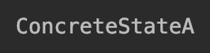

10.1 定义状态设计模式
===

&nbsp;&nbsp;&nbsp;&nbsp;&nbsp;&nbsp;&nbsp;行为模式关注的是对象的响应性。它们通过对象之间的交互以实现更强大的功能。状态设计模式是一种行为设计模式，有时也被称为状态模式的对象。在此模式中是，一个对象可以基于其内部状态封装多个行为。状态模式也可以看做是在运行时改变对象行为的一种方式。

&nbsp;&nbsp;&nbsp;&nbsp;&nbsp;&nbsp;&nbsp;下面，我们以收音机为例进行说明。收音机具有 `AM/FM`（切换开关）两种调频方式和一个扫描按钮，该按钮可扫描多个`AM/FM`频道。当用户打开无线电时，收音机的基本状态已经设计设置好了（例如，它被设置为`FM`）。通过单击扫描按钮，可以将收音机调谐到多个有效的FM频率或频道。然后，当基本状态改为`AM`时，扫描按钮则会帮助用户调谐到多个`AM`频道。因此，根据收音机的基本状态（`AM/FM`），当调谐到`AM`或`FM`频道时，扫描按钮的行为就会动态地改变。

&nbsp;&nbsp;&nbsp;&nbsp;&nbsp;&nbsp;&nbsp;因此，状态模式允许对象在其内部状态变化时改变其行为状态。这看起来就像对象本身已经改变了它的类一样。状态设计模式常用于开发有限状态机，并帮助协调状态处理操作。

> ## 10.1.1 理解状态设计模式

&nbsp;&nbsp;&nbsp;&nbsp;&nbsp;&nbsp;&nbsp;状态设计模式在3个主要参与者的协助下工作。

* `State`：这被认为是封装对象行为的接口。这个行为与对象的状态相关联；
* `ConcreteState`：这是实现`State`接口的子类。`ConcreteState`实现与对象的特定状态相关联的实际行为;
* `Context`：这定义了客户感兴趣的接口。`Context`还维护一个`ConcreteState`子类的实例，该子类在内部定义了对象的特定状态的实现。

&nbsp;&nbsp;&nbsp;&nbsp;&nbsp;&nbsp;&nbsp;下面我们来考察带有上述3个参与者的状态设计模式的结构代码实现。在这个代码实现中，我们定义了一个具有`Handle()`抽象方法的状态接口。`ConcreteState`类，`ConcreteStateA`和`ConcreteStateB`用于实现状态接口，同时，定义的`Handle()`方法是特定于`ConcreteState`类。因此，当`Context`类被设置为一个状态时，该状态的`Concrete`类的`Handle()`方法就会被调用。在以下示例中，由于`Context`设置为`stateA`，因此将调用`ConcreteStateA.Handle()`方法并打印`ConcreteStateA`：

```python
# -*- coding:utf-8 -*-

from abc import abstractmethod, ABCMeta


class State(metaclass=ABCMeta):

    @abstractmethod
    def Handle(self):
        pass


class ConcreteStateB(State):
    def Handle(self):
        print("ConcreteStateB")


class ConcreteStateA(State):
    def Handle(self):
        print("ConcreteStateA")


class Context(State):

    def __init__(self):
        self.state = None

    def getState(self):
        return self.state

    def setState(self, state):
        self.state = state

    def Handle(self):
        self.state.Handle()


if __name__ == '__main__':
    context = Context()
    stateA = ConcreteStateA()
    stateB = ConcreteStateB()

    context.setState(stateA)
    context.Handle()
```

&nbsp;&nbsp;&nbsp;&nbsp;&nbsp;&nbsp;&nbsp;我们将看到图10-1所示的输出。

<center>
    
    <br>
    <div style="color:orange; border-bottom: 0px solid #d9d9d9;
    display: inline-block;
    color: #999;
    padding: 5px;">图 10-1</div>
</center>

> ## 10.1.2 通过UML图理解状态设计模式

&nbsp;&nbsp;&nbsp;&nbsp;&nbsp;&nbsp;&nbsp;正如我们在上一节中看到的那样，在UML图中有3个主要参与者：`State`、`ConcreteState`和`Context`。在本节中，我们将利用UML类图来展示它们，如图10-2所示。

&nbsp;&nbsp;&nbsp;&nbsp;&nbsp;&nbsp;&nbsp;首先，让我们详细了解一下UML图的组成元素。

* `State`：这是一个定义了`Handle()`抽象方法的接口。`Handle()`方法需要通过`ConcreteState`类来实现；

    <center>
        
        <br>
        <div style="color:orange; border-bottom: 0px solid #d9d9d9;
        display: inline-block;
        color: #999;
        padding: 5px;">图 10-2</div>
    </center>

* `ConcreteState`：在这个UML图中，我们定义了两个`Concrete`类：`ConcreteStateA`和`ConcreteStateB`。它们都实现了`Handle()`方法，并可以根据状态的变化定义要采取的实际动作；
* `Context`：这是一个接受客户端请求的类。它还维护着对象的当前状态的引用。这样，就可以根据相应的请求，来调用具体的行为了。
