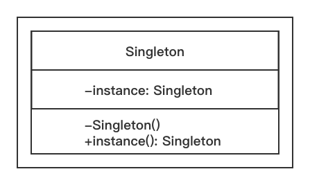

2.1 理解单例设计模式
===

&nbsp;&nbsp;&nbsp;&nbsp;&nbsp;&nbsp;&nbsp;单例模式提供了这样一个机制，即确保类有且只有一个特定类型的对象，并提供全局访问点。因此，单例模式通常用于下列情形，例如日志记录或数据库操作、打印机后台处理程序，以及其他程序——该程序运行过程中只能生成一个实例，以避免对同一资源产生相互冲突的请求。例如，我们可能希望使用一个数据库对象对数据库进行操作，以维护数据的一致性；或者希望使用一个日志类的对象，将多项服务的日志信息按照顺序转储到一个特定的日志文件中。

简言之，单例设计模式的意图如下所示。
* 确保类有且只有一个对象被创建
* 为对象提供一个访问点，以始程序可以全局访问该对象
* 控制共享资源的并行访问

图2-1是单例模式的UML图：

<center>
    
    <br>
    <div style="color:orange; border-bottom: 0px solid #d9d9d9;
    display: inline-block;
    color: #999;
    padding: 5px;">图 2-1</div>
</center>


&nbsp;&nbsp;&nbsp;&nbsp;&nbsp;&nbsp;&nbsp;实现单例模式的一个简单方法是，使构造函数私有化，并创建一个静态方法来完成对象的初始化。这样，对象将在第一次调用时创建，此后，这个类将返回同一个对象。
&nbsp;&nbsp;&nbsp;&nbsp;&nbsp;&nbsp;&nbsp;在使用Python的时候，我们的实现方式要有所变通，因为它无法创建私有的构造函数。下面，我们一起看看如何利用Python语言来实现单例模式。

## 利用Python实现经典的单例模式
下面是基于Python3 的单例模式实现代码，它主要完成了两件事情
* 只允许Singleton类生成一个实例
* 如果已经有一个实例了，我们会重复提供同一个对象

具体代码如下所示：
```python
# -*- coding:utf-8 -*-


class Singleton(object):
    def __new__(cls, *args, **kwargs):
        if not hasattr(cls, 'instance'):
            cls.instance = super(Singleton, cls).__new__(cls)
        return cls.instance


if __name__ == '__main__':
    s = Singleton()
    print('Object created', s, id(s))
    s1 = Singleton()
    print('Object created', s1, id(s1))
```

图2-2是以上代码的输出结果。
<center>
    
    <br>
    <div style="color:orange; border-bottom: 0px solid #d9d9d9;
    display: inline-block;
    color: #999;
    padding: 5px;">图 2-2</div>
</center>

&nbsp;&nbsp;&nbsp;&nbsp;&nbsp;&nbsp;&nbsp;在上面的代码中，我们通过覆盖`__new__`方法（Python用于实例化对象的特殊方法）来控制对象的创建。对象`s`就是由`__new__`方法创建的，但在创建之前，该方法会检查对象是否已存在。
&nbsp;&nbsp;&nbsp;&nbsp;&nbsp;&nbsp;&nbsp;方法`hasattr`（Python的特殊方法，用来了解对象是否具有某个属性）用于查看对象`cls`是否具有属性`instance`，该属性的作用是检查该类是否已经生成了一个对象。当对象`s1`被请求的时候，`hasattr()`发现对象已经存在，所以，对象`s1`将被分配已有的对象实例（地址位于 `0x102078ba8`）
