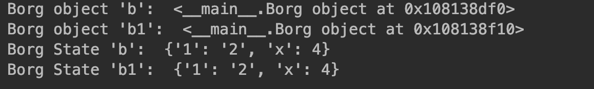

2.4 Monostate单例模式
===

&nbsp;&nbsp;&nbsp;&nbsp;&nbsp;&nbsp;&nbsp;这里我们讨论的是`GoF(the Gang of Four, GoF)`编写的设计模式图书的“第1章，设计模式入门”中的相关内容。`GoF(the Gang of Four, GoF)`的单例设计模式是指，一个类有且只有一个对象。然而，根据`Alex Martelli`的说法，通常程序员需要的是让实例共享相同的状态。他建议开发人员应该关注状态和行为，而不是同一性。由于该概念基于所有对象共享相同状态，因此它也被称为`Monostate（单态）模式`。
&nbsp;&nbsp;&nbsp;&nbsp;&nbsp;&nbsp;&nbsp;`Monostate`模式可以通过Python轻松实现。在下面的代码中，我们将类变量`__shared_state`赋值给了变量`__dict__`（它是Python的一个特殊变量）。Python使用`__dict__`存储一个类所有对象的状态。在下面的代码中，我们故意把`__shared_state`赋给所有已经创建的实例。所以，如果我们创建了两个实例“b”和“b1”，我们将得到两个不同的对象，这一点与单例模式大为不同，后者只能生成一个对象。然而，对象的状态，即`b.__dict__`和`b1.__dict__`却是相同的。现在，就算对象b的对象变量x发生了变化，这个变化也会复制到被所有对象共享的`__dict__`变量，即`b1`的变量`x`的值也会从1变为4。

```python
# -*- coding:utf-8 -*-


class Borg(object):
    __shared_state = {'1': '2'}

    def __init__(self):
        self.x = 1
        self.__dict__ = self.__shared_state


if __name__ == '__main__':
    b = Borg()
    b1 = Borg()
    b.x = 4
    print("Borg object 'b': ", b)
    print("Borg object 'b1': ", b1)
    print("Borg State 'b': ", b.__dict__)
    print("Borg State 'b1': ", b1.__dict__)

```
图2-3是以上代码的输出。
<center>
    
    <br>
    <div style="color:orange; border-bottom: 0px solid #d9d9d9;
    display: inline-block;
    color: #999;
    padding: 5px;">图 2-3</div>
</center> 

&nbsp;&nbsp;&nbsp;&nbsp;&nbsp;&nbsp;&nbsp;除此之外，我们还可以通过修改`__new__`方法本身来实现`Borg`模式。我们知道，`__new__`方法是用来创建对象的实例的，具体方法如下：

```python
# -*- coding:utf-8 -*-


class Borg(object):
    _shared_state = {'1': '2'}

    def __new__(cls, *args, **kwargs):
        obj = super(Borg, cls).__new__(cls, *args, **kwargs)
        obj.__dict__ = cls._shared_state
        return obj

```
