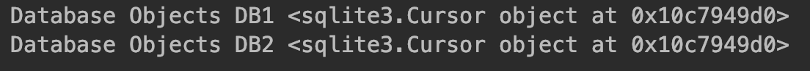

2.6 单例模式1
===

&nbsp;&nbsp;&nbsp;&nbsp;&nbsp;&nbsp;&nbsp;作为一个实际的用例，我们通过一个数据库应用程序来展示单例的应用。这里不妨以需要对数据库进行多种读取和写入操作的云服务为例来进行讲解。完整的云服务被分解为多个服务，每个服务执行不同的数据库操作。针对`UI（Web应用程序）`上的操作将导致调用`API`，最终产生相应的DB操作。
&nbsp;&nbsp;&nbsp;&nbsp;&nbsp;&nbsp;&nbsp;很明显，跨不同服务的共享资源是数据库本身。因此，如果我们需要更好地设计云服务，必须注意以下几点：
* 数据库中操作的一致性，即一个操作不应与其他操作发生冲突
* 优化数据库的各种操作，以提高内存和CPU的利用率

这里提供一个示例Python实现：

```python
# -*- coding:utf-8 -*-

import sqlite3


class MetaSingleton(type):
    _instances = {}

    def __call__(cls, *args, **kwargs):
        if cls not in cls._instances:
            cls._instances[cls] = super(MetaSingleton, cls).__call__(*args, **kwargs)
        return cls._instances[cls]


class Database(metaclass=MetaSingleton):
    connection, cursor_obj = None, None

    def connect(self):
        if self.connection is None:
            self.connection = sqlite3.connect("db.sqlite3")
            self.cursor_obj = self.connection.cursor()
        return self.cursor_obj


if __name__ == '__main__':
    db1 = Database().connect()
    db2 = Database().connect()

    print("Database Objects DB1", db1)
    print("Database Objects DB2", db2)

```

上面代码的输出如图 2-5 所示
<center>
    
    <br>
    <div style="color:orange; border-bottom: 0px solid #d9d9d9;
    display: inline-block;
    color: #999;
    padding: 5px;">图 2-5</div>
</center> 

通过阅读上面的代码，我们会发现以下几点。

* 我们以`MetaSingleton`为名创建了一个元类。就像在上一节中解释的那样，Python的特殊方法`__call__`可以通过元类创建单例
* 数据库类由 `MetaSingleton` 类装饰后，其行为就会表现为单例。因此，当数据库类被实例化时，它只创建一个对象。
* 当 Web 应用程序对数据库执行某些操作时，它会多次实例化数据库类，但只创建一个对象。因为只有一个对象，所以对数据库的调用是同步的。此外，这样还能够节约系统资源，并且可以避免消耗过多的内存或CPU资源

&nbsp;&nbsp;&nbsp;&nbsp;&nbsp;&nbsp;&nbsp;假如我们要开发的不是单个Web应用程序，而是集群化的情形，即多个Web应用共享单个数据库。当然，单例在这种情况下好像不太好使，因为每增加一个Web应用程序，就要新建一个单例，添加一个新的对象来查询数据库。这导致数据库操作无法同步，并且要耗费大量的资源。在这种情况下，数据库连接池比实现单例要好得多。
