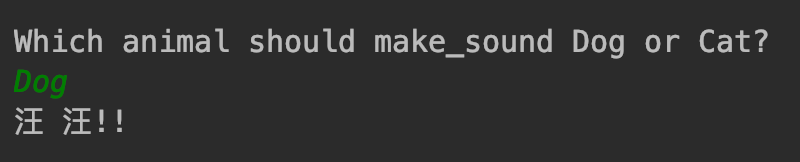

3.2 简单工厂模式
===

&nbsp;&nbsp;&nbsp;&nbsp;&nbsp;&nbsp;&nbsp;对于一些人来说，简单工厂本身不是一种模式。开发人员在进一步了解这个概念之前，首先需要详细了解工厂方法和抽象工厂方法。工厂可以帮助开发人员和创建不同类型的对象，而不是直接将对象实例化。
&nbsp;&nbsp;&nbsp;&nbsp;&nbsp;&nbsp;&nbsp;图 3-1 是简单工厂的`UML` 图，将有助于我们理解这一点。这里，客户端类使用的是 `Factory` 类，该类具有 `create_type()` 方法，当客户端使用类型参数调用 `create_type()` 方法时， `Factory` 会根据传入的参数，返回 `Product1` 或 `Product2`。

<center>
    
    <br>
    <div style="color:orange; border-bottom: 0px solid #d9d9d9;
    display: inline-block;
    color: #999;
    padding: 5px;">图 3-1</div>
</center>

&nbsp;&nbsp;&nbsp;&nbsp;&nbsp;&nbsp;&nbsp;现在，让我们借助Python代码示例来进一步理解简单工厂模式。在下面的代码段中，我们将创建一个名为 `Animal1` 的抽象产品。 `Animal1` 是一个抽象的基类（ABCMeta 是Python的特殊元类，用来生成类 Abstract），他代收方法 `do_say()`。我们利用 `Animal` 接口创建的联众产品（`Cat`和`Dog`），并实现了`do_say()`方法来提供这些动物的相应的叫声。`ForestFactory`是一个代有 `make_sound()`方法的工厂。根据客户端传递的番薯类型，它就可以在运行时创建适当的 `Animal`实例，并输出正确的声音：

```python
# -*- coding:utf-8 -*-
from abc import ABCMeta, abstractclassmethod


class Animal(metaclass=ABCMeta):
    @abstractclassmethod
    def do_say(cls):
        pass


class Dog(Animal):
    def do_say(self):
        print("汪 汪!!")


class Cat(Animal):
    def do_say(self):
        print("喵 喵!!")


# forest factory defined
class ForestFactory(object):
    @staticmethod
    def make_sound(object_type):
        return eval(object_type)().do_say()


# client code
if __name__ == '__main__':
    ff = ForestFactory()
    animal = input("Which animal should make_sound Dog or Cat?\n")
    ff.make_sound(animal)

```
图 3-2 是上述代码段的输出

<center>
    
    <br>
    <div style="color:orange; border-bottom: 0px solid #d9d9d9;
    display: inline-block;
    color: #999;
    padding: 5px;">图 3-2</div>
</center>
