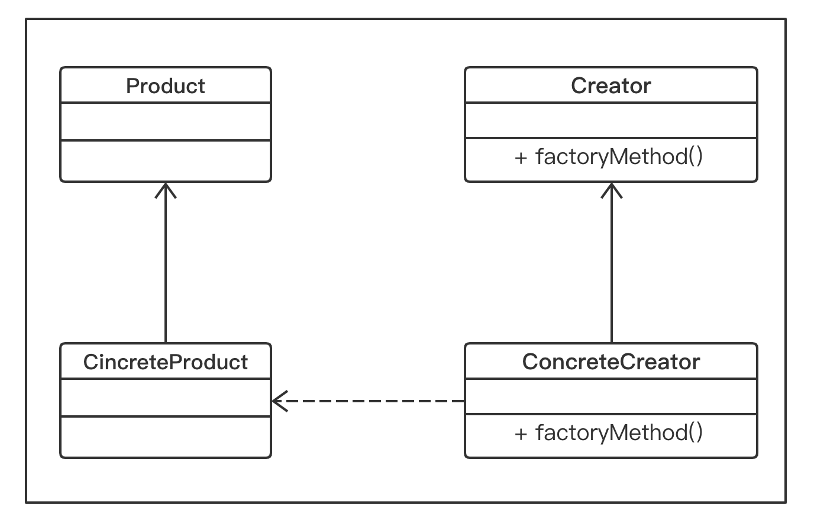
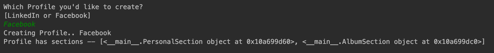

3.3 工厂方法模式
===

以下几点可以帮助我们了解工厂方法模式
* 我们定义了一个接口来创建对象，但是工厂本身并不负责创建对象，而是将这一任务交由子类来完成，即子类决定了要实例化哪些类。
* `Factory` 方法的创建时通过继承而不是通过实例化来完成的。
* 工厂方法使设计更加具有可定制型。他可以返回相同的实例或子类，而不是某种类型的对象（就像在简单工厂方法中的那样）。

&nbsp;&nbsp;&nbsp;&nbsp;&nbsp;&nbsp;&nbsp;在图 3-3 所示的`UML`图中，有一个包含 `factoryMethod()` 方法的抽象类 `Creator`。`factoryMethod()`方法负责创建指定类型的对象。`ConcreteCreator` 类提供了一个实现 `Creator` 抽象类的 `factoryMethod()`方法，这种方法可以再运行时修改已创建的对象。`ConcreteCreator`创建`ConcreteProduct`，并确保其创建的对象实现了`Product`类，同时为`Product`接口中的所有方法提供相应的实现。

&nbsp;&nbsp;&nbsp;&nbsp;&nbsp;&nbsp;&nbsp;简而言之，`Creator`接口的`factoryMethod()`方法和`ConcreteCreator`类共同决定了要创建`Product`的哪个子类。因此，工厂方法模式定义了一个接口来创建对象，但具体实例化哪个类，则是由它的子类决定的。

<center>
    
    <br>
    <div style="color:orange; border-bottom: 0px solid #d9d9d9;
    display: inline-block;
    color: #999;
    padding: 5px;">图 3-3</div>
</center>

## 3.3.1 实现工厂方法

&nbsp;&nbsp;&nbsp;&nbsp;&nbsp;&nbsp;&nbsp;让我们拿一个现实世界的场景来理解工厂方法的实现。假设我们想在不同类型的社交网络（例如：`LinkedIn`、`Facebook`等）上为个人或公司建立简介。那么，每个简介都有某些特定的组成章节。在`LinkedIn`的简介中，有一个章节是关于个人申请的专利或出版作品的。在`Facebook`上，你将在相册中看到最近度假地点的照片区。此外，在这两个简介中，都有一个个人信息的区。因此，简而言之，我们要通过将正确的区添加到相应的简介中来创建不同类型的简介。
&nbsp;&nbsp;&nbsp;&nbsp;&nbsp;&nbsp;&nbsp;下面让我们来看看具体如何实现。在下面的代码示例中，首先定义接口 `Product`。我们将创建一个`Section`抽象类来定义一个区是关于哪方面内容的，让它尽量保持简单，同时还提供一个抽象方法 `describe()`。
&nbsp;&nbsp;&nbsp;&nbsp;&nbsp;&nbsp;&nbsp;然后，我们会创建多个`ConcreteProduct`、`PersonalSection`、`AlbumSection`、`PatentSection`和`PublicationSection`类。这些类用于实现`describe()`抽象方法并打印他们各自的区名称：

```python
# -*- coding:utf-8 -*-

from abc import ABCMeta, abstractclassmethod


class Section(metaclass=ABCMeta):
    @abstractclassmethod
    def describe(cls):
        pass
    

class PersonalSection(Section):
    def describe(self):
        print("Personal Section")
        

class AlbumSection(Section):
    def describe(self):
        print("Album Section")


class PatentSection(Section):
    def describe(self):
        print("Patent Section")


class PublicationSection(Section):
    def describe(self):
        print("Publication Section")

```

&nbsp;&nbsp;&nbsp;&nbsp;&nbsp;&nbsp;&nbsp;我们创建一个名为`Profile`的抽象类`Creator`。`Profile[Creator]`抽象类提供了一个工厂方法，即`create_profile()`。`create_profile()`方法应该由`ConcreteClass`实现，来实际创建戴有适当区的简介。`Profile`抽象类不知道每个简介应具有哪些区。例如，`Facebook`的简介应该提供个人信息区和相册区。所以，我们将让子类来决定这些事情。
&nbsp;&nbsp;&nbsp;&nbsp;&nbsp;&nbsp;&nbsp;我们创建了两个`ConcreteCreator`类，即`LinkedIn`和`Facebook`。每个类都实现`create_profile()`抽象方法，由该方法在运行时实际创建（实例化）多个区（`ConcreteProducts`）：

```python
class Profile(metaclass=ABCMeta):
    def __init__(self):
        self.sections = []
        self.create_profile()

    @abstractclassmethod
    def create_profile(cls):
        pass

    def get_sections(self):
        return self.sections

    def add_sections(self, section):
        self.sections.append(section)


class Linkedin(Profile):
    def create_profile(self):
        self.add_sections(PersonalSection())
        self.add_sections(PatentSection())
        self.add_sections(PublicationSection())


class Facebook(Profile):
    def create_profile(self):
        self.add_sections(PersonalSection())
        self.add_sections(AlbumSection())
```

&nbsp;&nbsp;&nbsp;&nbsp;&nbsp;&nbsp;&nbsp;最后，我们开始编写决定实例化哪个`Creator`类的客户端代码，以便让它根据指定的选项创建所需的简介：

```python
if __name__ == '__main__':
    profile_type = input("Which Profile you'd like to create?\n[LinkedIn or Facebook]\n")
    profile = eval(profile_type)()
    print("Creating Profile..", type(profile).__name__)
    print("Profile has sections --", profile.get_sections())
```

上述代码段的输出如图 3-4 所示

<center>
    
    <br>
    <div style="color:orange; border-bottom: 0px solid #d9d9d9;
    display: inline-block;
    color: #999;
    padding: 5px;">图 3-4</div>
</center>

## 3.3.2 工厂方法模式的优点

在前面部分，我们已经学习了工厂方法模式，并掌握了工厂方法的实现，接下来让我们看看工厂方法模式的优点。
* 它具有更大的灵活性，使得代码更加通用，因为它不是单纯地实例化某个类。这样实现哪些类取决于接口（`Product`），而不是`ConcreteProduct`类。
* 他们是松耦合的，因为创建对象的代码与使用它的代码是分开的。客户端完全不需要关心要传递哪些参数以及需要实例化哪些类。由于添加新类更容易，所以降低了维护成本。
