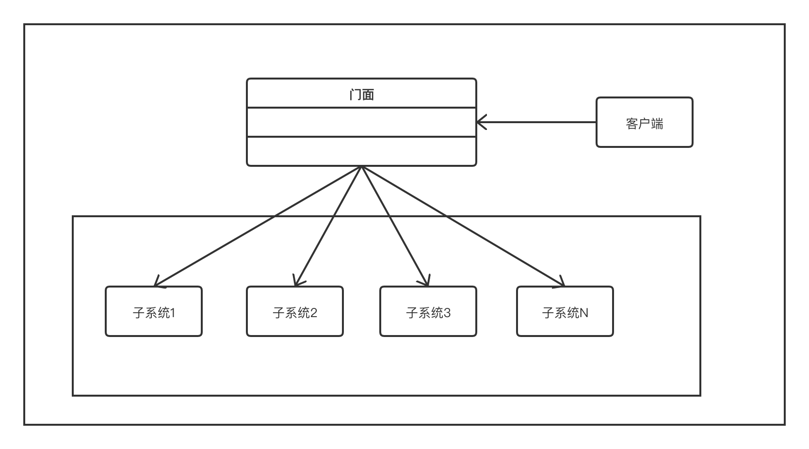

4.3 UML类图
===

&nbsp;&nbsp;&nbsp;&nbsp;&nbsp;&nbsp;&nbsp;现在我们可以借助于图 4-1 的`UML`图来深入探讨门面模式。

    
     
    
图 4-1

&nbsp;&nbsp;&nbsp;&nbsp;&nbsp;&nbsp;&nbsp;就像你在UML图中看到的那样，这个模式有3个主要的参与者。
* 门面：门面的主要职责是，将一组复杂的系统封装起来，从而为外部提供一个舒适的外观
* 系统：这代表一组不同的子系统，使整个系统混杂在一起，难以观察或使用
* 客户端：客户端与门面机型交互，这样就可以轻松地与子系统进行通信并完成工作了。不必担心体统的复杂性

&nbsp;&nbsp;&nbsp;&nbsp;&nbsp;&nbsp;&nbsp;现在，我们将会从数据结构的角度进一步介绍这3个主要参与者

## 门面
&nbsp;&nbsp;&nbsp;&nbsp;&nbsp;&nbsp;&nbsp;以下几点可以帮助我们更好地理解门面
* 它是一个接口，它知道某个请求可以交由哪个子系统进行处理
* 它使用组合将客户端的请求委派给相应的子系统对象

&nbsp;&nbsp;&nbsp;&nbsp;&nbsp;&nbsp;&nbsp;例如，如果客户端正在了解哪些工作已完成，则不需要到各个子系统去，相反，它只需要联系完成工作的接口（门面）就可以了。

## 系统
&nbsp;&nbsp;&nbsp;&nbsp;&nbsp;&nbsp;&nbsp;在门面的世界里，系统就是执行以下操作的实体。
* 它实现子系统的功能，同时，系统由一个类表示。理想情况下，系统应该由一组负责不同任务的类来表示
* 它处理门面对象分配的工作，但并不知道门面，而且不引用它

&nbsp;&nbsp;&nbsp;&nbsp;&nbsp;&nbsp;&nbsp;例如，当客户端向门面请求某项服务时，门面会根据服务的类型来选择提供该服务的相应子系统。

## 客户端
&nbsp;&nbsp;&nbsp;&nbsp;&nbsp;&nbsp;&nbsp;以下是我们队客户端的描述。
* 客户端是实例化门面的类
* 为了让子系统完成相应的工作，客户端需要向门面提出要求
