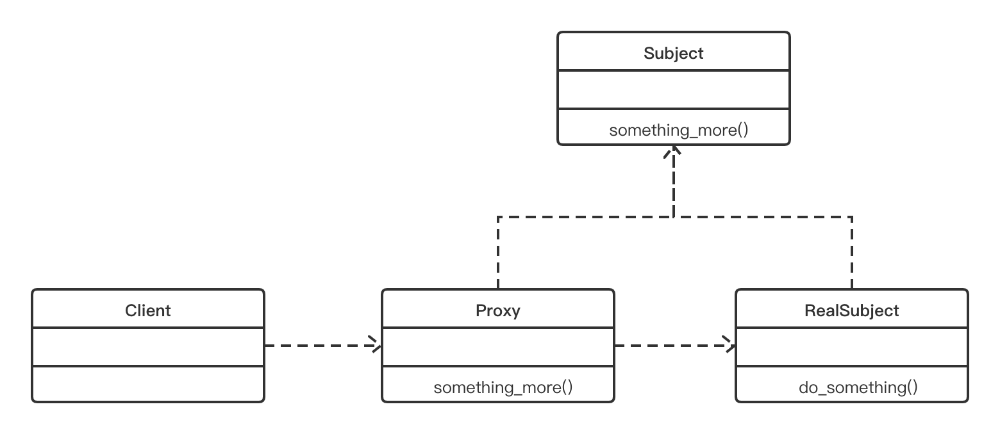

5.2 代理模式的UML类图
===

&nbsp;&nbsp;&nbsp;&nbsp;&nbsp;&nbsp;&nbsp;现在，我们可以借助于图 5-1 中的UML图来探讨代理模式。正如我们在上一段中所介绍的那样，代理模式有3个主要角色：制作公司、经纪人和演员。下面，让我们把这些角色放入一个 UML 图中，看看这些类如何关联。

    
     
    
图 5-1

&nbsp;&nbsp;&nbsp;&nbsp;&nbsp;&nbsp;&nbsp;通过观察这个UML图，你会发现这个模式有下述3个主要的参与者。
* **代理**：他维护一个引用，允许代理（`Proxy`）通过这个引用来访问实际对象。它提供了一个与主题（`Subject`）相同的接口，以便代理可以替换真实的主题。代理还负责创建和删除真实主题（`RealSubject`）
* **主题**：它定义了`RealSubject`和`Proxy`的公共接口。以`Proxy`和`RealSubject`的形式实现主题（`Subject`），使用`RealSubject`的任何地方都可以使用代理（`Proxy`）
* **真实主题**：它定义了代理（`Proxy`）所代表的的真实对象

&nbsp;&nbsp;&nbsp;&nbsp;&nbsp;&nbsp;&nbsp;从数据结构的角度来看，UML图可以表示如下

* **代理**：它是一个控制对`RealSubject`类访问的类.它处理客户端的请求,负责创建或删除`RealSubject`
* **主题/真实主题**：主题是定义真实主题（`RealSubject`）和代理（`Proxy`）相类似的接口。`RealSubject`是`Subject`接口的实际实现。他提供了真正的功能，然后由客户端使用
* **客户端**：它访问要完成工作的`Proxy`类。`Proxy`类在内部控制对`RealSubject`的访问，并引导客户端（`Client`）所请求工作
