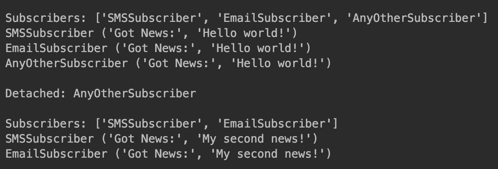

6.3 现实世界中的观察者模式
===

&nbsp;&nbsp;&nbsp;&nbsp;&nbsp;&nbsp;&nbsp;我们将以新闻机构为例来展示观察者模式饿现实世界场景。新闻机构通常从不同地点收集新闻，并将其发布给订阅者。下面，让我们来看看这个用例的设计注意事项。

&nbsp;&nbsp;&nbsp;&nbsp;&nbsp;&nbsp;&nbsp;由于信息是实时发送或接收的，所以新闻机构应该尽快向其订户公布该消息。此外，随着技术的进步，订户不仅可以订阅报纸，而且可以通过其他的形式进行订阅，例如电子邮件、移动设备、短信或语音呼叫，所以，我们还应该具备在将来添加任意其他订阅形式的能力，以便为未来的新技术做好准备。

&nbsp;&nbsp;&nbsp;&nbsp;&nbsp;&nbsp;&nbsp;让我们利用Python来开发一个应用程序，实现上面的用例。
&nbsp;&nbsp;&nbsp;&nbsp;&nbsp;&nbsp;&nbsp;我们将从主题开始，这里的主题是新闻发布者：
* 主题的行为由`NewsPubilsher`类表示；
* `NewsPubilsher`提供了一个供订户使用的接口；
* `NewsPubilsher`提供了一个供订户使用的接口；
* `attach()`方法供观察者`Observer`来注册`NewsPubilsherObserver`，`detach()`方法用于注销；
* `subscriber()`方法返回已经使用`Subject`注册的所有订户的列表；
* `notifySubscriber()`方法可以用来遍历已向`NewsPubilsher`注册的所有订户；
* 发布者可以使用`addNews()`方法创建新消息，`getNews()`用于返回最新消息，并通知观察者。

&nbsp;&nbsp;&nbsp;&nbsp;&nbsp;&nbsp;&nbsp;现在让我们来考察一下`NewsPublisher`类：

```python
# -*- coding:utf-8 -*-


class NewsPublisher(object):
    def __init__(self):
        self.__subscribers = []
        self.__latestNews = None

    def attach(self, subscriber):
        self.__subscribers.append(subscriber)

    def detach(self, subscriber):
        # return self.__subscribers.pop()
        return self.__subscribers.remove(subscriber)

    def subscribers(self):
        return [type(x).__name__ for x in self.__subscribers]

    def notifySubscribers(self):
        for sub in self.__subscribers:
            sub.update()

    def addNews(self, news):
        self.__latestNews = news

    def getNews(self):
        return "Got News:", self.__latestNews
```

&nbsp;&nbsp;&nbsp;&nbsp;&nbsp;&nbsp;&nbsp;现在让我们来讨论观察者（`Observer`）接口：
* 在这个例子中，`Subscriber`表示`Observer`，它是一个抽象的基类，代表其他`ConcreteObserver`；
* `Subscriber`有一个update()方法，但是它需要由`ConcreteObservers`实现；
* `update()`方法是由`ConcreteObserver`实现的，这样只要有新闻发布的时候，它们都能够得到`Subject(NewsPublishers)`的相应通知。

&nbsp;&nbsp;&nbsp;&nbsp;&nbsp;&nbsp;&nbsp;现在让我们看看`Subscriber`抽象类的代码：

```python
# -*- coding:utf-8 -*-
from abc import ABCMeta, abstractmethod


class Subscriber(metaclass=ABCMeta):

    @abstractmethod
    def update(self):
        pass
```

&nbsp;&nbsp;&nbsp;&nbsp;&nbsp;&nbsp;&nbsp;我们还开发了代表具体观察者的一些类：
* 在本例中，我们有两个主要观察者，分别是实现订户接口的`EmailSubscriber`和`SMSSubscriber`；
* 除了这两个之外，我们建立了另外一个观察者`AnyOtherObserver`，它是用来演示`Observers`与`Subject`的松散耦合关系的；
* 每个具体观察者的`__init__()`方法都是使用`attach()`方法向`NewsPublishers`进行注册的；
* 具体观察者的`update()`方法由`NewsPublishers`在内部用来通知添加了新的新闻。

&nbsp;&nbsp;&nbsp;&nbsp;&nbsp;&nbsp;&nbsp;下面是实现`SMSSubscriber`类的具体代码：

```python
class SMSSubscriber(object):
    def __init__(self, publisher):
        self.publisher = publisher
        self.publisher.attch(self)
        
    def update(self):
        print(type(self).__name__, self.publisher.getNews())
        
        
class EmailSubscriber(object):
    def __init__(self, publisher):
        self.publisher = publisher
        self.publisher.attch(self)

    def update(self):
        print(type(self).__name__, self.publisher.getNews())


class AnyOtherSubscriber(object):
    def __init__(self, publisher):
        self.publisher = publisher
        self.publisher.attch(self)

    def update(self):
        print(type(self).__name__, self.publisher.getNews())
```

&nbsp;&nbsp;&nbsp;&nbsp;&nbsp;&nbsp;&nbsp;现在，所需的订户都已经实现好了，下面让我们来考察`NewsPublisher`和`SMSSubscribers`类。

* 客户端为`NewsPublisher`创建一个对象，以供具体观察者用于各种操作；
* 使用发布者的对象初始化`SMSSubscriber`、`EmailSubscriber`和`AnyOtherSubscriber`类；
* 在Python中，当我们创建对象时，`__init__()`方法就会被调用。在`ConcreteObserver`类中，`__init__()`方法在内部使用`NewsPublisher`的`attach()`方法进行注册以获取新闻更新；
* 然后，我们打印出已经通过主题注册的所有订户（具体观察者）的列表；
* 接着，使用`newsPublishers(news_publisher)`的对象通过`addNews()`方法创建新消息；
* `NewsPublisher`的`notifySubscribers()`方法用户通知所有订户出现了新消息。`notifySubscribers()`方法在内部调用具体观察者实现的`update()`方法，以便他们可以获得最新的消息；
* `NewsPublisher`还提供了`detach()`方法，可以从注册订户列表中删除订户。


&nbsp;&nbsp;&nbsp;&nbsp;&nbsp;&nbsp;&nbsp;一下代码展示了主题和观察者之间的交互：

```python
if __name__ == '__main__':

    news_publisher = NewsPublisher()
    for Subscribers in [SMSSubscriber, EmailSubscriber, AnyOtherSubscriber]:
        Subscribers(news_publisher)
    print("\nSubscribers:", news_publisher.subscribers())

    news_publisher.addNews('Hello world!')
    news_publisher.notifySubscribers()

    print("\nDetached:", type(news_publisher.detach()).__name__)
    print("\nSubscribers:", news_publisher.subscribers())

    news_publisher.addNews('My second news!')
    news_publisher.notifySubscribers()
```

&nbsp;&nbsp;&nbsp;&nbsp;&nbsp;&nbsp;&nbsp;上述代码的输出结果如图6-3所示。

<center>
    
    <br>
    <div style="color:orange; border-bottom: 0px solid #d9d9d9;
    display: inline-block;
    color: #999;
    padding: 5px;">图 6-3</div>
</center>

