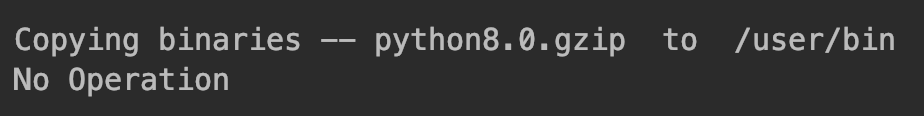
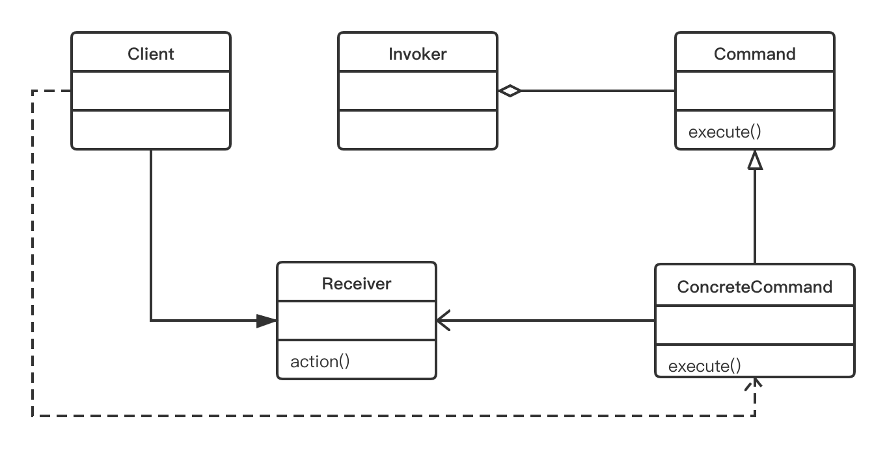

7.2 了解命令设计模式
===

&nbsp;&nbsp;&nbsp;&nbsp;&nbsp;&nbsp;&nbsp;命令模式通常使用以下术语：`Commond`、`Receiver`、`Invoker`和`Client`：
* `Commond`对象了解`Receiver`对象的情况，并能调用`Receiver`对象的方法；
* 调用者方法的参数值存储在`Commond`对象中；
* 调用者知道如何执行命令；
* 客户端用来创建`Commond`对象并设置其接收者；

&nbsp;&nbsp;&nbsp;&nbsp;&nbsp;&nbsp;&nbsp;命令模式的主要意图如下：
* 将请求封装为对象；
* 可用不同的请求对客户进行参数化；
* 允许将请求保存在队列中（我们将在本章后面进行讨论）；
* 提供面向对象的回调。

&nbsp;&nbsp;&nbsp;&nbsp;&nbsp;&nbsp;&nbsp;命令模式可用于以下各种情景：
* 根据需要执行的操作对对象进行参数化；
* 将操作添加到队列并在不同得点执行请求；
* 创建一个结构来根据较小操作完成高级操作；

&nbsp;&nbsp;&nbsp;&nbsp;&nbsp;&nbsp;&nbsp;以下的Python代码实现了命令设计模式。在本章前面，我们曾经讨论了向导的例子。假设我们想要开发一个安装向导，或者更常见的安装程序。通常，安装意味着需要根据用户做出的选择来复制或移动文件系统中的文件。在下面的示例中，我们首先在客户端代码中创建`Wizard`对象，然后使用`preferences()`方法存储用户在向导的各个屏幕期间做出的选择。在向导中点击`Finish`按钮时，就会调用`execute()`方法。之后，`execute()`将会根据首选项来开始安装：

```python
# -*- coding:utf-8 -*-


class Wizard(object):
    def __init__(self, src, root_dir):
        self.choices = []
        self.root_dir = root_dir
        self.src = src

    def preferences(self, command):
        self.choices.append(command)

    def execute(self):
        for choice in self.choices:
            if list(choice.values())[0]:
                print("Copying binaries --", self.src, " to ", self.root_dir)
            else:
                print("No Operation")


if __name__ == '__main__':
    # client code
    wizard = Wizard('python8.0.gzip', '/user/bin')
    # Users chooses to install Python only
    wizard.preferences({'python': True})
    wizard.preferences({'java': False})
    wizard.execute()
```

&nbsp;&nbsp;&nbsp;&nbsp;&nbsp;&nbsp;&nbsp;上述代码的输入如下：
<center>
    
    <br>
    <div style="color:orange; border-bottom: 0px solid #d9d9d9;
    display: inline-block;
    color: #999;
    padding: 5px;"></div>
</center>

> ## 命令模式的UML类图

&nbsp;&nbsp;&nbsp;&nbsp;&nbsp;&nbsp;&nbsp;现在，让我们借助UML图来深入理解命令模式。
&nbsp;&nbsp;&nbsp;&nbsp;&nbsp;&nbsp;&nbsp;正如我们在上一段中讨论的那样，命令模式的主要参与者为：`Commond`、`ConcreteCommand`、`Receiver`、`Invoker`和`Client`。
&nbsp;&nbsp;&nbsp;&nbsp;&nbsp;&nbsp;&nbsp;让我们把这些角色放在一个UML图中（见图7-1），看看这些类是如何交互的。

<center>
    
    <br>
    <div style="color:orange; border-bottom: 0px solid #d9d9d9;
    display: inline-block;
    color: #999;
    padding: 5px;">图 7-1</div>
</center>

&nbsp;&nbsp;&nbsp;&nbsp;&nbsp;&nbsp;&nbsp;通过该UML图不难发现，该模式主要涉及5个参与者：
* `Commond`：生命执行操作的接口；
* `ConcreteCommand`：将一个`Receiver`对象和一个操作绑定在一起；
* `Client`：创建`ConcreteCommand`对象并设定其接收者；
* `Invoker`：要求该`ConcreteCommand`执行这个请求；
* `Receiver`：知道如何实施与执行一个请求相关的操作。

&nbsp;&nbsp;&nbsp;&nbsp;&nbsp;&nbsp;&nbsp;整个流程图是非常简单的，客户端请求执行命令，调用者接受命令，封装它并将其放置到队列中。`ConcreteCommand`类根据所请求的命令来指导接收者执行特定的动作。通过阅读以下代码，可以帮助我们进一步了解该模式中所有参与者的情况：

```python
# -*- coding:utf-8 -*-

from abc import ABCMeta, abstractmethod


class Command(metaclass=ABCMeta):
    def __init__(self, _recv):
        self.recv = _recv

    def execute(self):
        pass


class ConcreteCommand(Command):
    def __init__(self, _recv):
        super().__init__(_recv)
        self.recv = _recv

    def execute(self):
        self.recv.action()


class Receiver(object):
    @staticmethod
    def action():
        print("Receiver Action")


class Invoker(object):
    def __init__(self):
        self.cmd = None

    def command(self, _cmd):
        self.cmd = _cmd

    def execute(self):
        self.cmd.execute()


if __name__ == '__main__':
    recv = Receiver()
    cmd = ConcreteCommand(recv)
    invoker = Invoker()
    invoker.command(cmd)
    invoker.execute()
```
