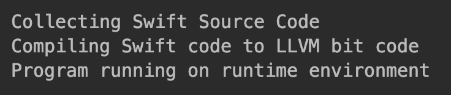

8.1 定义模板方法模式
===

&nbsp;&nbsp;&nbsp;&nbsp;&nbsp;&nbsp;&nbsp;正如我们再上一章中所看到的，行为模式主要关注对象的响应性。它处理对象之间交互已实现更强大的功能。模板方法模式是一种行为涉及模式，通过一种称为模板方法的方式来定义程序框架或算法。例如，你可以将制作饮料的步骤定义为模板方法中的算法。模板方法模式还通过将这些步骤中的一些实现推迟到子类来帮助重新定义或定制算法的某些步骤。这意味着子类可以重新定义自己的行为。例如，在这种情况下，子类可以使用制作饮料的模板方法来实现沏茶的步骤。需要重点关注的是，步骤的改变（如子类所做的）并不影响原始算法的结构。因此，在模板方法模式中的子类可以通过覆盖来创建不同的行为或算法。

&nbsp;&nbsp;&nbsp;&nbsp;&nbsp;&nbsp;&nbsp;在讨论模板方法模式的时候，按照软件开发术语来说，我们可以使用抽象来来定义算法的步骤。这些步骤在模板方法模式的上下文中也称为原始操作。这些步骤通常用抽象方法定义，而模板方法则用来定义算法。`ConcreteClass`（子类化抽象类）则用来实现算法中子类的特定步骤。

&nbsp;&nbsp;&nbsp;&nbsp;&nbsp;&nbsp;&nbsp;模板方法模式适用于以下场景：
* 当多个算法或类实现类似或相同逻辑的时候；
* 在子类中实现算法有助于减少重复代码的时候；
* 可以让子类利用覆盖实现行为来定义多个算法的时候。

&nbsp;&nbsp;&nbsp;&nbsp;&nbsp;&nbsp;&nbsp;让我们用一个日常生活中的简单例子来理解该模式。回想一下在沏茶或煮咖啡时都会做些什么。在煮咖啡的情况下，通常需要执行以下步骤来制备饮料。

1. 烧开水；
1. 研磨咖啡豆；
1. 把它倒在咖啡杯里；
1. 将糖和牛奶加入杯中；

&nbsp;&nbsp;&nbsp;&nbsp;&nbsp;&nbsp;&nbsp;现在如果你想准备一杯茶，你将执行以下步骤：

1. 烧开水；
1. 泡茶；
1. 将茶水倒入杯中；
1. 向茶水中加柠檬；
1. 搅拌，一杯茶就沏好了。

&nbsp;&nbsp;&nbsp;&nbsp;&nbsp;&nbsp;&nbsp;分析这两个制作过程，你会发现两者基本一致。在这种情况下，模板方法模式就有了用武之地了。我们该如何实现它呢？我们首先定义一个`Beverage`类，让它提供准备茶和咖啡的通用抽象方法，如`boilWater()`。此外，我们还定义一个模板方法`preparation()`，让它来负责处理准备饮料（算法）的步骤序列。最后，我们让具体类，即`PrepareCoffee`和`PrepareTea`，来定义制作咖啡和茶时特有的步骤。模板方法模式就是通过这种方式来避免代码重复的。

&nbsp;&nbsp;&nbsp;&nbsp;&nbsp;&nbsp;&nbsp;另一个简单的例子是计算机语言使用的编译器。编译器本质上做两件事：收集源代码并将其编译为目标对象。现在，如果需要为`iOS`设备定义交叉编译器，我们可以在模板方法模式的帮助下实现它。我们将在本章后面详细介绍这个例子。

> ## 8.1.1 了解模板方法设计模式

&nbsp;&nbsp;&nbsp;&nbsp;&nbsp;&nbsp;&nbsp;简而言之，模板方法模式的主要意图如下：

* 使用基本操作定义算法的框架；
* 重新定义子类的某些操作，而无需修改算法的结构；
* 实现代码重用并避免重复工作；
* 利用通用接口或实现。

&nbsp;&nbsp;&nbsp;&nbsp;&nbsp;&nbsp;&nbsp;模板方法模式使用以下术语——`AbstractClass`、`ConcreteClass`、`TemplateMethod`和`Client`。
* `AbstractClass`：生命一个定义算法步骤的接口；
* `ConcreteClass`：定义子类特定的步骤；
* `template_methon()`：通过调用步骤方法来定义算法。

&nbsp;&nbsp;&nbsp;&nbsp;&nbsp;&nbsp;&nbsp;我们再本章前面讨论过一个编译器的例子。假设想为`iOS`设备开发自己的交叉编译器并运行程序。

&nbsp;&nbsp;&nbsp;&nbsp;&nbsp;&nbsp;&nbsp;我们首先开发一个抽象类（编译器），来定义编译器的算法。编译器执行的操作时手机由程序语言编写的源代码，然后编译成目标代码（二进制格式）。我们将这些步骤定义为`collect_source()`和`compile_to_object()`抽象方法，同时还定义了负责执行程序的`run()`方法。该算法是由`compile_and_run()`方法来定义的，它通过内部调用`collect_source()`、`compile_to_object()`和`run()`方法来定义编译器的算法。

&nbsp;&nbsp;&nbsp;&nbsp;&nbsp;&nbsp;&nbsp;然后，让具体类`iOSCompiler`实现抽象方法，在`iOS`设备商编译并运行`Swift`代码。

&nbsp;&nbsp;&nbsp;&nbsp;&nbsp;&nbsp;&nbsp;下面的Python代码用于实现模板方法设计模式：

```python
# -*- coding:utf-8 -*-

from abc import ABCMeta, abstractmethod


class Compiler(metaclass=ABCMeta):
    @abstractmethod
    def collect_source(self):
        pass

    @abstractmethod
    def compile_to_object(self):
        pass

    @abstractmethod
    def run(self):
        pass

    def compile_and_run(self):
        self.collect_source()
        self.compile_to_object()
        self.run()


class IOSCompiler(Compiler):
    def collect_source(self):
        print("Collecting Swift Source Code")

    def compile_to_object(self):
        print("Compiling Swift code to LLVM bit code")

    def run(self):
        print("Program running on runtime environment")


if __name__ == '__main__':
    iOS = IOSCompiler()
    iOS.compile_and_run()
```

&nbsp;&nbsp;&nbsp;&nbsp;&nbsp;&nbsp;&nbsp;上述代码的输出结果如图 8-1 所示：

<center>
    
    <br>
    <div style="color:orange; border-bottom: 0px solid #d9d9d9;
    display: inline-block;
    color: #999;
    padding: 5px;">图 8-1</div>
</center>

> ## 8.1.2 模板方法模式的UML类图

&nbsp;&nbsp;&nbsp;&nbsp;&nbsp;&nbsp;&nbsp;现在，让我们借助于UML图来深入了解模板方法模式。

&nbsp;&nbsp;&nbsp;&nbsp;&nbsp;&nbsp;&nbsp;正如在上一节中所介绍的那样，模板方法模式的主要角色有：抽象类、具体类、模板方法和客户端。下面，让我们把这些角色放入一个UML图中（见图 8-2 ），看看这些类是如何关联的。

<center>
    
    <br>
    <div style="color:orange; border-bottom: 0px solid #d9d9d9;
    display: inline-block;
    color: #999;
    padding: 5px;">图 8-2</div>
</center>

&nbsp;&nbsp;&nbsp;&nbsp;&nbsp;&nbsp;&nbsp;通过观察下面的UML图，你会发现这个模式有4个主要参与者。
* `AbstractClass`：在抽象方法的帮助下定义算法的操作或步骤。这些步骤将被具体子类覆盖；
* `template_method()`：定义算法的框架。在模板方法中调用抽象方法定义的多个步骤来定义序列或算法本身；
* `ConcreteClass`：实现（由抽象方法定义的）步骤，来执行算法子类的特定步骤。

&nbsp;&nbsp;&nbsp;&nbsp;&nbsp;&nbsp;&nbsp;以下是一个代码示例，展示了该模式中所有参与者的关系：

```python
# -*- coding:utf-8 -*-

from abc import ABCMeta, abstractmethod


class AbstractClass(metaclass=ABCMeta):
    def __init__(self):
        pass

    @abstractmethod
    def operation1(self):
        pass

    @abstractmethod
    def operation2(self):
        pass

    def template_method(self):
        print("Defining the Algorithm. Operation1 follows Operation2")
        self.operation1()
        self.operation2()


class ConcreteClass(AbstractClass):
    def operation1(self):
        print("My Concrete Operation1")

    def operation2(self):
        print("Operation 2 remains same")


class Client(object):
    def __init__(self):
        self.concrete = None

    def main(self):
        self.concrete = ConcreteClass()
        self.concrete.template_method()


if __name__ == '__main__':
    client = Client()
    client.main()
```

&nbsp;&nbsp;&nbsp;&nbsp;&nbsp;&nbsp;&nbsp;上述代码的输出结果如图 8-3 所示：

<center>
    
    <br>
    <div style="color:orange; border-bottom: 0px solid #d9d9d9;
    display: inline-block;
    color: #999;
    padding: 5px;">图 8-3</div>
</center>
