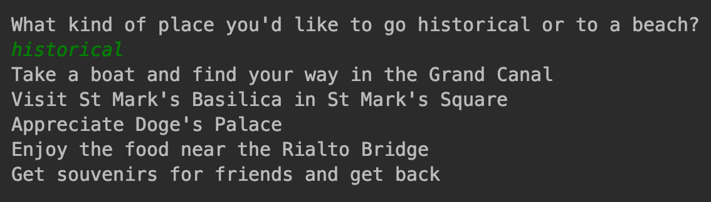

8.2 现实世界中的模板方法模式
===

&nbsp;&nbsp;&nbsp;&nbsp;&nbsp;&nbsp;&nbsp;让我们用一个非常容易理解的案例来实现模板方法模式。想象一个旅行社的例子，例如`Dev Travels`。那么，他们通常是如何运作的呢？他们定义了各种旅游路线，并提供度假套装行程。一个行程套餐本质上是你作为客户允诺的一次旅行。旅行还涉及一些详细信息，如游览的地点，交通方式和与旅行有关的其他因素。当然，同样的行程可以根据客户的需求进行不同的定制。在这种情况下，模板方法模式就有了用武之地，不是吗？

&nbsp;&nbsp;&nbsp;&nbsp;&nbsp;&nbsp;&nbsp;设计注意事项：
* 对于上述场景，根据UML图来看，我们应该创建一个定义旅行的`AbstractClass`接口；
* 旅行应包含多个抽象方法，定义所使用的的交通方式，在第1天、第2天和第3天所游览的地点（假设这是一个为期3天的周末旅行），并定义回程；
* 模板方法`itinerary()`将定义该旅行的行程；
* 我们应该定义`ConcreteClasses`，以帮助我们根据客户的需要对旅行进行相应的定制。

&nbsp;&nbsp;&nbsp;&nbsp;&nbsp;&nbsp;&nbsp;让我们使用Python开发一个程序，实现前面的用例。

&nbsp;&nbsp;&nbsp;&nbsp;&nbsp;&nbsp;&nbsp;让我们先从抽象类开始，即`Trip`：
* 抽象对象由`Trip`类表示。它是一个接口（Python的抽象基类），定义了不同日子使用的交通方式和参观的地点等细节；
* setTransport是一个抽象方法，它由`ConcreteClass`实现，作用是设置交通方式；
* `day1()`、`day2()`、`day3()`抽象方法定义了特定日期所参观的地点；
* `itinerary()`模板方法创建完整的行程（即算法，在本例中为旅行）。旅行的序列为，首先定义交通模式，然后是每天要参观的地点，以及`returnHome`。

&nbsp;&nbsp;&nbsp;&nbsp;&nbsp;&nbsp;&nbsp;以下代码实现了`Dev Travels`的用例：

```python
# -*- coding:utf-8 -*-

from abc import ABCMeta, abstractmethod


class Trip(metaclass=ABCMeta):
    @abstractmethod
    def set_transport(self):
        pass

    @abstractmethod
    def day1(self):
        pass

    @abstractmethod
    def day2(self):
        pass

    @abstractmethod
    def day3(self):
        pass

    @abstractmethod
    def return_home(self):
        pass
    
    def itinerary(self):
        self.set_transport()
        self.day1()
        self.day2()
        self.day3()
        self.return_home()
```

&nbsp;&nbsp;&nbsp;&nbsp;&nbsp;&nbsp;&nbsp;我们还开发了代表具体类的某些类：
* 在本例中，我们主要有两个实现`Trip`接口的具体类：`VeniceTrip`和`MaldivesTrip`；
* 这两个具体类代表有课根据他们选择和兴趣所进行的两次不同的旅行；
* `VeniceTrip`和`MaldivesTrip`都实现了`set_transport()`、`day1()`、`day2()`、`day3()`和`return_home()`

&nbsp;&nbsp;&nbsp;&nbsp;&nbsp;&nbsp;&nbsp;让我们在Python代码中定义具体的类：

```python
class VeniceTrip(Trip):
    def set_transport(self):
        print("Take a boat and find your way in the Grand Canal")

    def day1(self):
        print("Visit St Mark's Basilica in St Mark's Square")

    def day2(self):
        print("Appreciate Doge's Palace")

    def day3(self):
        print("Enjoy the food near the Rialto Bridge")

    def return_home(self):
        print("Get souvenirs for friends and get back")


class MaldivesTrip(Trip):
    def set_transport(self):
        print("On foot, on any island, Wow!")

    def day1(self):
        print("Enjoy the marine life of Banana Reef")

    def day2(self):
        print("Go for the water sports and snorkelling")

    def day3(self):
        print("Relax on the beach and enjoy the sun")

    def return_home(self):
        print("Dont feel like leaving the beach...")
```

&nbsp;&nbsp;&nbsp;&nbsp;&nbsp;&nbsp;&nbsp;现在，让我们来考察一下旅行社和希望度过一个愉快假期的游客：
* `TraveAgency`类代表该实例中的`Client`对象；
* 它定义了`arrange_trip()`方法，让客户选择历史旅行或海滩旅行；
* 根据旅游者的选择，形影的类将被实例化；
* 这个对象然后调用`itinerary()`模板方法，并根据客户的选择为有课安排相应的旅行。

&nbsp;&nbsp;&nbsp;&nbsp;&nbsp;&nbsp;&nbsp;以下是`Dev`旅行社以及他们如何根据客户的选择安排旅行的具体实现：

```python
class TravelAgency(object):

    def __init__(self):
        self.trip = None

    def arrange_trip(self):
        choice = input("What kind of place you'd like to go historical or to a beach?\n")
        if choice == 'historical':
            self.trip = VeniceTrip()
        elif choice == 'beach':
            self.trip = MaldivesTrip()
        self.trip.itinerary()


if __name__ == '__main__':
    mark = TravelAgency()
    mark.arrange_trip()
```

&nbsp;&nbsp;&nbsp;&nbsp;&nbsp;&nbsp;&nbsp;上述代码的输出结果如图 8-4 所示：

<center>
    
    <br>
    <div style="color:orange; border-bottom: 0px solid #d9d9d9;
    display: inline-block;
    color: #999;
    padding: 5px;">图 8-4</div>
</center>


&nbsp;&nbsp;&nbsp;&nbsp;&nbsp;&nbsp;&nbsp;如果你选择的是历史旅行，代码的输出结果如图 8-5 所示：

<center>
    
    <br>
    <div style="color:orange; border-bottom: 0px solid #d9d9d9;
    display: inline-block;
    color: #999;
    padding: 5px;">图 8-5</div>
</center>
