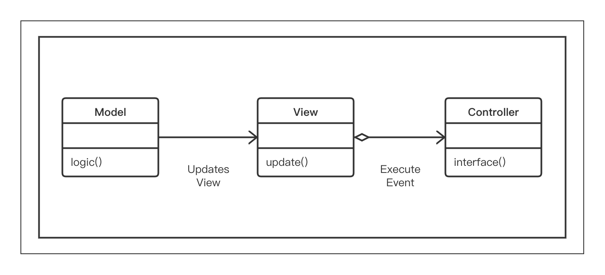

9.3 MVC设计模式的UML图
===

&nbsp;&nbsp;&nbsp;&nbsp;&nbsp;&nbsp;&nbsp;现在，让我们借助UML图来深入理解`MVC`模式。正如我们再上一节中讨论的那样，`MVC`模式的主要参与者为：模型、视图和控制器类，如图 9-3 所示。

<center>
    
    <br>
    <div style="color:orange; border-bottom: 0px solid #d9d9d9;
    display: inline-block;
    color: #999;
    padding: 5px;">图 9-3</div>
</center>

&nbsp;&nbsp;&nbsp;&nbsp;&nbsp;&nbsp;&nbsp;在UML图中，我们可以看到这个模式的3个主要类。
* `Model`类：定义与客户端的某些任务有关的业务逻辑或操作；
* `View`类：定义客户端查看的视图或展示。模型根据业务逻辑向视图呈现数据；
* `Controller`类：这实际上是视图和模型之间的接口。当客户端采取某些操作时，控制器将来自视图的查询传递给模型。

&nbsp;&nbsp;&nbsp;&nbsp;&nbsp;&nbsp;&nbsp;以下是一个代码示例，可以帮助我们理解该模式中所有参与者的交互情况：

```python
# -*- coding:utf-8 -*-


class Model(object):
    def logic(self):
        data = 'Got it!'
        print("Model: Crunching data as per business logic")
        return data


class View(object):
    def update(self, data):
        print("View: Updating the view with results: ", data)


class Controller(object):
    def __init__(self):
        self.model = Model()
        self.view = View()

    def interface(self):
        print("Controller: Relayed the Client asks")
        data = self.model.logic()
        self.view.update(data)


class Client(object):
    print("Client: asks for certain information")
    controller = Controller()
    controller.interface()
```

&nbsp;&nbsp;&nbsp;&nbsp;&nbsp;&nbsp;&nbsp;上述代码的输出结果如图 9-4 所示。

<center>
    
    <br>
    <div style="color:orange; border-bottom: 0px solid #d9d9d9;
    display: inline-block;
    color: #999;
    padding: 5px;">图 9-4</div>
</center>
