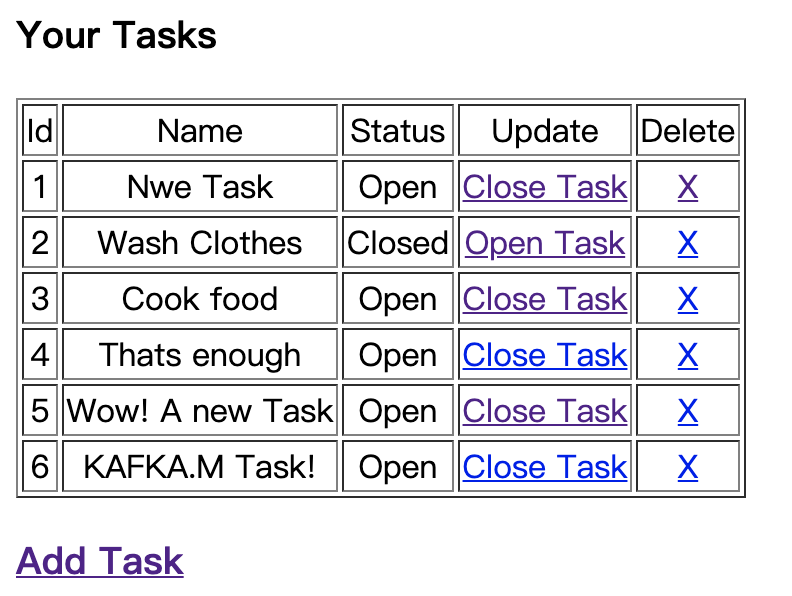
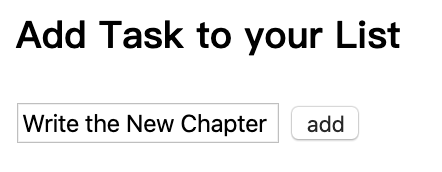
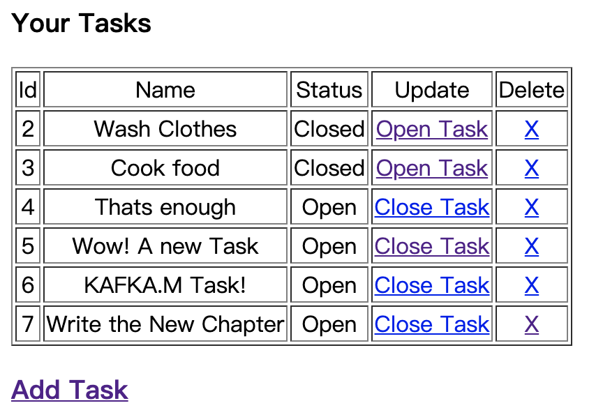

9.4 现实世界中的MVC模式
===

&nbsp;&nbsp;&nbsp;&nbsp;&nbsp;&nbsp;&nbsp;我们从前的`Web`应用程序框架也是基于`MVC`的优秀理念的。以`Django`或`Rails(Ruby)`为例：它们都是以模式-视图-控制器来构造项目，只是形式为模型、模板、视图（`Model-Template-View，MTV`），其中模型是数据库，模板是视图，控制器是视图/路由。举例来说，假设要用`Tornado Web`应用程序框架（`http://www.tornadoweb.org/en/stable/`）来开发一个单页应用程序。这个应用程序用于管理用户的各种任务，同时用户还具有添加任务、更新任务和删除任务权限。

&nbsp;&nbsp;&nbsp;&nbsp;&nbsp;&nbsp;&nbsp;让我们来了解一下设计的注意事项
* 让我们先从控制器开始。在 `Tornado`中，控制器被定义为视图/应用程序路由。我们需要定义多个视图，例如列出任务、创建新任务、关闭任务，以及在无法处理请求时的操作；
* 我们还应该定义模型，即列出、创建或删除任务的数据库操作；
* 最后，视图由`Tornado`中的模板显示。对于应用程序来说，我们需要一个模板来显示、创建或删除任务，以及另一个模板用于没有找到 URL时的情形。

> 9.4.1 模块

&nbsp;&nbsp;&nbsp;&nbsp;&nbsp;&nbsp;&nbsp;我们的应用程序需要用到一下模块：
* `Tornado==4.3`
* `SQLite3==2.6.0`

&nbsp;&nbsp;&nbsp;&nbsp;&nbsp;&nbsp;&nbsp;首先，在我们的应用程序中导入相应的Python模块：

```python
import tornado
import tornado.web
import tornado.ioloop
import tornado.httpserver
import sqlite3
```

&nbsp;&nbsp;&nbsp;&nbsp;&nbsp;&nbsp;&nbsp;下面的代码提供了数据库才做，实际上就是`MVC`中的模型。在`Tornado`中，数据库操作是在不同的处理程序下执行的。处理程序根据用户再`Web`应用程序中请求的路由对数据库执行操作。在这里讨论的是在这个例子中创建的4个程序。

* `IndexHandler`：返回存储在数据库中的所有任务。它返回一个与关键人物有关的字典。它执行`SELECT`数据库操作来获取这些任务；
* `NewHandler`：顾名思义，它对添加新任务很有用。它检查是否有一个`POST`调用来创建一个新任务，并在数据库操作来获取这些任务；
* `UpdateHandler`：在将任务标记为完成或重新打开给定任务时非常有用。在这种情况下，将执行`UPDATE`数据库操作，将任务的状态置位`open/closed`；
* `DeleteHandler`：这将从数据库中删除指定的任务。一旦删除，任务将会从任务列表中消失。

&nbsp;&nbsp;&nbsp;&nbsp;&nbsp;&nbsp;&nbsp;我们还开发了一个`_execute()`方法，它以`SQLite`查询作为输入并执行所需的数据库操作。`_execute()`方法对`SQLite DB`执行以下操作：

* 创建`SQLite DB`连接；
* 获取游标对象；
* 使用游标对象执行事务；
* 提交查询；
* 关闭连接。

&nbsp;&nbsp;&nbsp;&nbsp;&nbsp;&nbsp;&nbsp;让我们看看Python实现中的处理程序：

```python
def _execute(query):
    """ Method to run query on sqlite db """
    db_path = 'db.db'
    connection = sqlite3.connect(db_path)
    cursor_obj = connection.cursor()
    try:
        cursor_obj.execute(query)
        result = cursor_obj.fetchall()
        connection.commit()
    except Exception:
        raise
    connection.close()
    return result


class IndexHandler(tornado.web.RequestHandler):
    """ Home Page """
    def get(self):
        query = "select * from task"
        todos = _execute(query)
        self.render('index.html', todos=todos)


class NewHandler(tornado.web.RequestHandler):
    """ Add a task to teh task list """
    def post(self):
        name = self.get_argument('name', None)
        query = "create table if not exists task (id INTEGER PRIMARY KEY, name TEXT, status NUMERIC) "
        _execute(query)
        query = "insert into task (name, status) values ('%s', %d) " % (name, 1)
        _execute(query)
        self.redirect('/')

    def get(self):
        self.render('new.html')


class UpdateHandler(tornado.web.RequestHandler):
    """ Update status of the task to Open/Closed"""
    def get(self, id, status):
        query = "update task set status=%d where id=%s" %(int(status), id)
        _execute(query)
        self.redirect('/')


class DeleteHandler(tornado.web.RequestHandler):
    """ Delete task from task list """
    def get(self, id):
        query = "delete from task where id=%s" % id
        _execute(query)
        self.redirect('/')
```

&nbsp;&nbsp;&nbsp;&nbsp;&nbsp;&nbsp;&nbsp;当考察这些方法时，你会注意到一些名为`self.render()`的东西。

&nbsp;&nbsp;&nbsp;&nbsp;&nbsp;&nbsp;&nbsp;这基本上就是MVC中的视图（`Tornado`框架中的模板）。

&nbsp;&nbsp;&nbsp;&nbsp;&nbsp;&nbsp;&nbsp;我们有3个主要模板。

* `index.html`：这是一个用于列出所有任务的模板；
* `new.html`：这是用于创建新任务的视图；
* `base.html`：这是继承其他模板的基本模板。

&nbsp;&nbsp;&nbsp;&nbsp;&nbsp;&nbsp;&nbsp;参考下面的代码：

base.html

```html
<html>
<!DOCTYPE>
<html>
    <head>
        
    </head>
    <body>
        
    </body>
</html>
```

index.html

```html

<title>ToDo</title>

    <h3>Your Tasks</h3>
    <table border="1" >
    <tr align="center">
        <td>Id</td>
        <td>Name</td>
        <td>Status</td>
        <td>Update</td>
        <td>Delete</td>
    </tr>
    
        <tr align="center">
            <td>{{todo[0]}}</td>
            <td>{{todo[1]}}</td>
            
                <td>Open</td>
            
                <td>Closed</td>
            
            
                <td><a href="/todo/update/{{todo[0]}}/status/0">Close Task</a></td>
            
                <td><a href="/todo/update/{{todo[0]}}/status/1">Open Task</a></td>
            
            <td><a href="/todo/delete/{{todo[0]}}">X</a></td>
        </tr>
    
    </table>

    <div>
        <h3><a href="/todo/new">Add Task</a></h3>
    </div>

```

new.html

```html

<title>ToDo</title>

    <div>
        <h3>Add Task to your List</h3>
        <form action="/todo/new" method="post" id="new">
            <p><input type="text" name="name" placeholder="Enter task"/>
            <input type="submit" class="submit" value="add" /></p>
        </form>
    </div>

```

&nbsp;&nbsp;&nbsp;&nbsp;&nbsp;&nbsp;&nbsp;在`Tornado`中，我们还有应用程序路由，它们相当于MVC中的控制器。

&nbsp;&nbsp;&nbsp;&nbsp;&nbsp;&nbsp;&nbsp;在这个示例中，我们有4个应用程序路由。

* `/`：这用于列出所有任务的路由；
* `/todo/new`：这是创建新任务的路由；
* `/todo/update`：这是将任务状态更新为打开或关闭的路由；
* `/todo/delete`：这是删除已完成任务的路由。

&nbsp;&nbsp;&nbsp;&nbsp;&nbsp;&nbsp;&nbsp;代码示例如下所示：

```python
class RunApp(tornado.web.Application):
    """ Configuration to run the App """
    def __init__(self):
        Handlers = [
            (r'/', IndexHandler),
            (r'/todo/new', NewHandler),
            (r'/todo/update/(\d+)/status/(\d+)', UpdateHandler),
            (r'/todo/delete/(\d+)', DeleteHandler),
        ]
        settings = dict(
            debug=True,
            template_path='templates',
            static_path="static",
        )
        tornado.web.Application.__init__(self, Handlers, **settings)
```

&nbsp;&nbsp;&nbsp;&nbsp;&nbsp;&nbsp;&nbsp;我们还提供了应用程序设置，并且可以启动HTTP Web服务器来运行应用程序：

```python
if __name__ == '__main__':
    http_server = tornado.httpserver.HTTPServer(RunApp())
    http_server.listen(5000, '127.0.0.1')
    tornado.ioloop.IOLoop.instance().start()
```

&nbsp;&nbsp;&nbsp;&nbsp;&nbsp;&nbsp;&nbsp;当我们运行这个Python程序时：

1. 服务器将启动，并在端口5000上运行，适当的视图、模板和控制器已经配置好了；
2. 浏览http:// localhost:5000 /，可以看到任务列表。

&nbsp;&nbsp;&nbsp;&nbsp;&nbsp;&nbsp;&nbsp;图9-5显示了浏览器中的输出内容。

<center>
    
    <br>
    <div style="color:orange; border-bottom: 0px solid #d9d9d9;
    display: inline-block;
    color: #999;
    padding: 5px;">图 9-5</div>
</center>

3. 我们还可以添加新任务。一旦你点击ADD按钮，就会添加一个新的任务。在以下屏幕截图中，添加了一个新任务“Write the New Chapter”，并显示在任务列表中，如图9-6所示。

<center>
    
    <br>
    <div style="color:orange; border-bottom: 0px solid #d9d9d9;
    display: inline-block;
    color: #999;
    padding: 5px;">图 9-6</div>
</center>

&nbsp;&nbsp;&nbsp;&nbsp;&nbsp;&nbsp;&nbsp;当我们输入新任务并单击ADD按钮时，任务将添加到现有任务列表中，如图9-7所示。

<center>
    
    <br>
    <div style="color:orange; border-bottom: 0px solid #d9d9d9;
    display: inline-block;
    color: #999;
    padding: 5px;">图 9-7</div>
</center>

4. 我们可以关闭UI的任务。例如，我们更新Cook food 任务，那么列表也会更新。如果愿意，我们还可以重新打开任务，如图9-8所示。

<center>
    
    <br>
    <div style="color:orange; border-bottom: 0px solid #d9d9d9;
    display: inline-block;
    color: #999;
    padding: 5px;">图 9-8</div>
</center>

5. 我们也可以删除任务。在这里，我们删除第一个任务——New Task，这时任务列表就会进行相应的更新以删除该任务，如图9-9所示。

<center>
    
    <br>
    <div style="color:orange; border-bottom: 0px solid #d9d9d9;
    display: inline-block;
    color: #999;
    padding: 5px;">图 9-9</div>
</center>

> ## 9.4.2 MVC模式的优点

&nbsp;&nbsp;&nbsp;&nbsp;&nbsp;&nbsp;&nbsp;以下是MVC模式的优点。

* 使用MVC，开发人员可以将软件应用程序分为3个主要部分：模型、视图和控制器。这有助于提高可维护性，强制松耦合，并降低复杂性；
* MVC允许对前端进行独立更改，而对后端逻辑无需任何修改或只需进行很少的更改，因此开发工作仍可以独立运行；
* 类似地，可以更改模型或业务逻辑，而无需对视图进行任何更改；
* 此外，可以更改控制器，而不会对视图或模型造成任何影响；
* MVC还有助于招聘具有特定能力的人员，例如平台工程师和UI工程师，他们可以在自己的专业领域独立工作。
